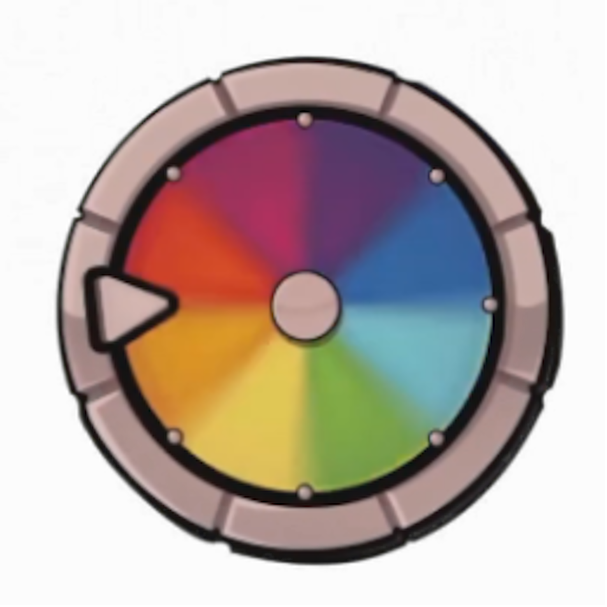

<h1 align="center">DEDsafio Launcher</h1>

[
]()

[
]()

    </a>

<ins>
Descarga:

Puede descargar el lanzador desde las Releases de GitHub.

Plataformas compatibles:

Windows
Linux
MacOS
Si descarga desde las Releases, seleccione el instalador correspondiente a su sistema.

Plataforma | Archivo |
| -------- | ---- |
| Windows x64 | `Selvania-Launcher-win-x64.exe ` |
| macOS x64 | `Selvania-Launcher-mac-x64.dmg` |
| macOS arm64 | `Selvania-Launcher-mac-arm64.dmg` |
| Linux x64 | `Selvania-Launcher-linux-x86_64.AppImage` |

---
